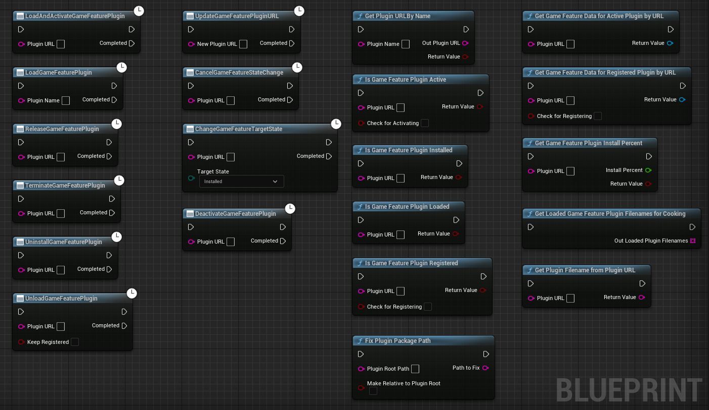

# UEGameFeatureUtilPlugin

This is an experimental implementation of wrapper plugin for Game Feature Subsystem in Unreal Engine 5.1.1.
It contains 10 Latent nodes and 11 Blueprint Function Library nodes

Latent nodes:

- LoadGameFeaturePlugin
- LoadAndActivateGameFeaturePlugin
- ChangeGameFeatureTargetState
- UpdateGameFeaturePluginURL
- DeactivateGameFeaturePlugin
- UnloadGameFeaturePlugin
- ReleaseGameFeaturePlugin
- UninstallGameFeaturePlugin
- TerminateGameFeaturePlugin
- CancelGameFeatureStateChange

Blueprint Function Library nodes:

- GetGameFeatureDataForActivePluginByURL
- GetGameFeatureDataForRegisteredPluginByURL
- IsGameFeaturePluginInstalled
- IsGameFeaturePluginRegistered
- IsGameFeaturePluginLoaded
- GetGameFeaturePluginInstallPercent
- IsGameFeaturePluginActive
- GetPluginURLByName
- GetPluginFilenameFromPluginURL
- FixPluginPackagePath
- GetLoadedGameFeaturePluginFilenamesForCooking

